# オノマトペ判定アプリ / Onomatopoeia Detector

iOSアプリ、Androidアプリ、PWA。音声入力された日本語をひらがな表記に整え、オノマトペらしさを5段階で評価します。

| ホーム | 判定結果 | 履歴 | 設定 |
|---|---|---|---|
| 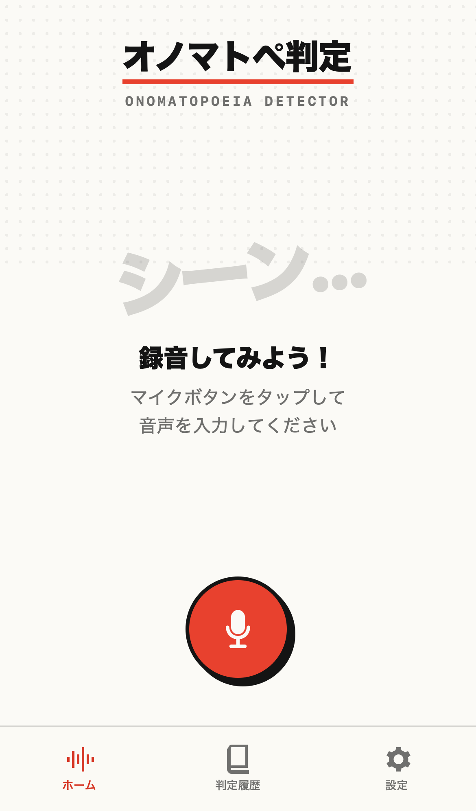 | 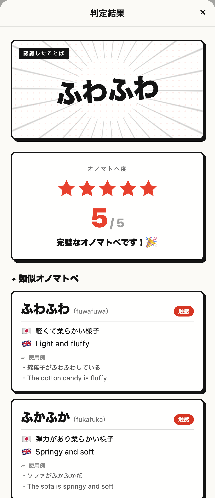 | 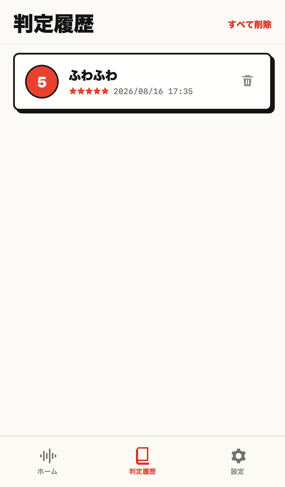 | 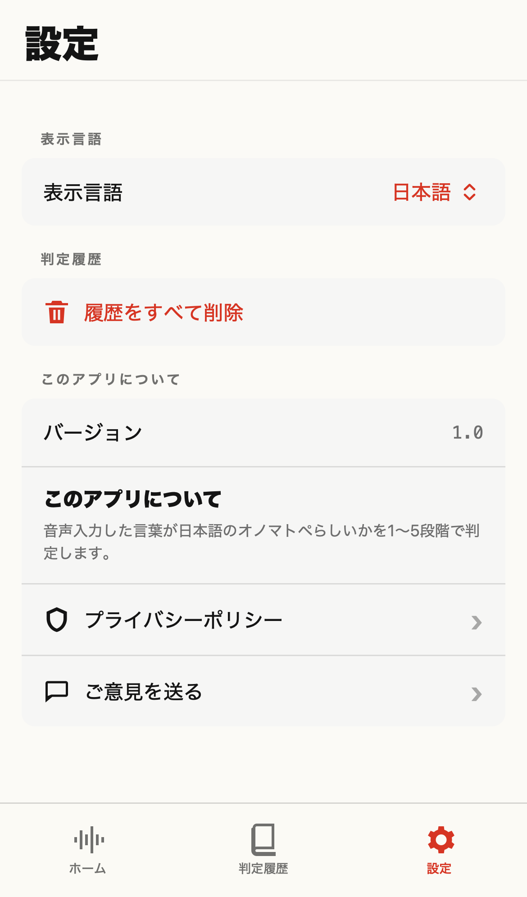 |

<details>
<summary>ダークモード / English</summary>

ダークモードと英語表示にも対応しています。表示言語は端末の設定に追従するほか、アプリ内でも切り替えられます。

| ホーム | 判定結果 | 履歴 | 設定 |
|---|---|---|---|
| 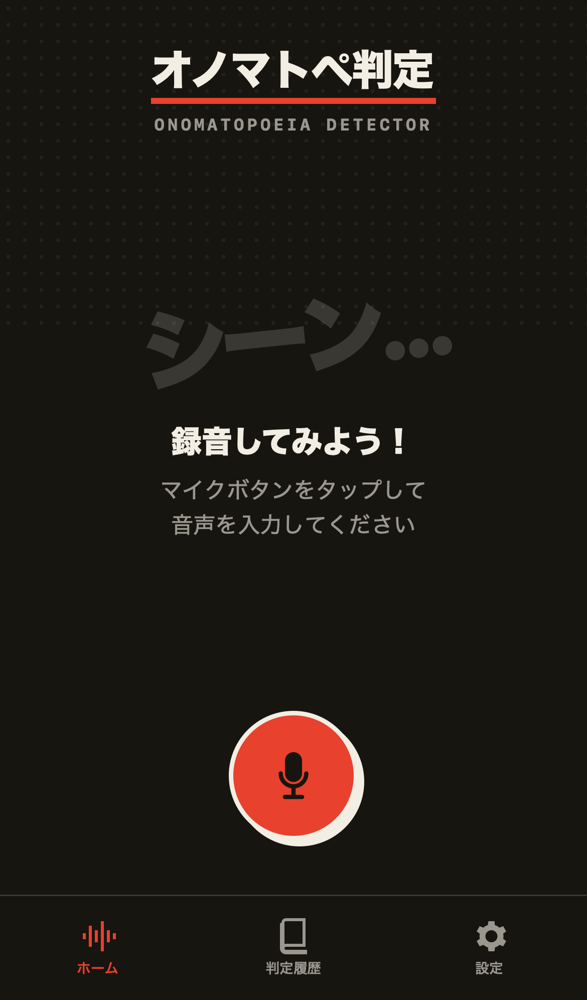 | 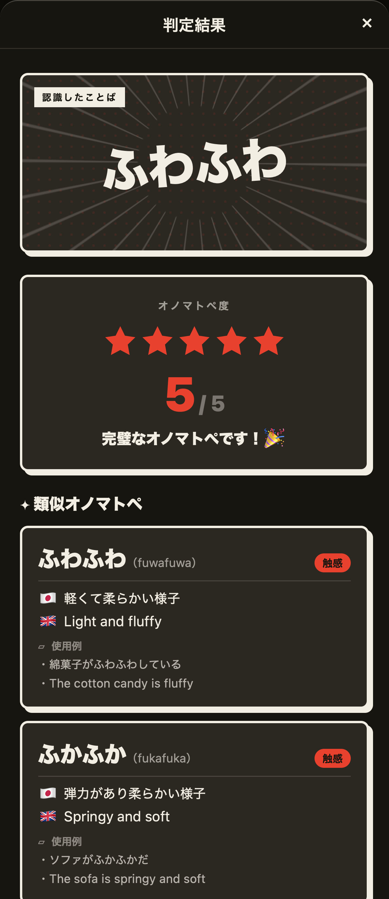 | 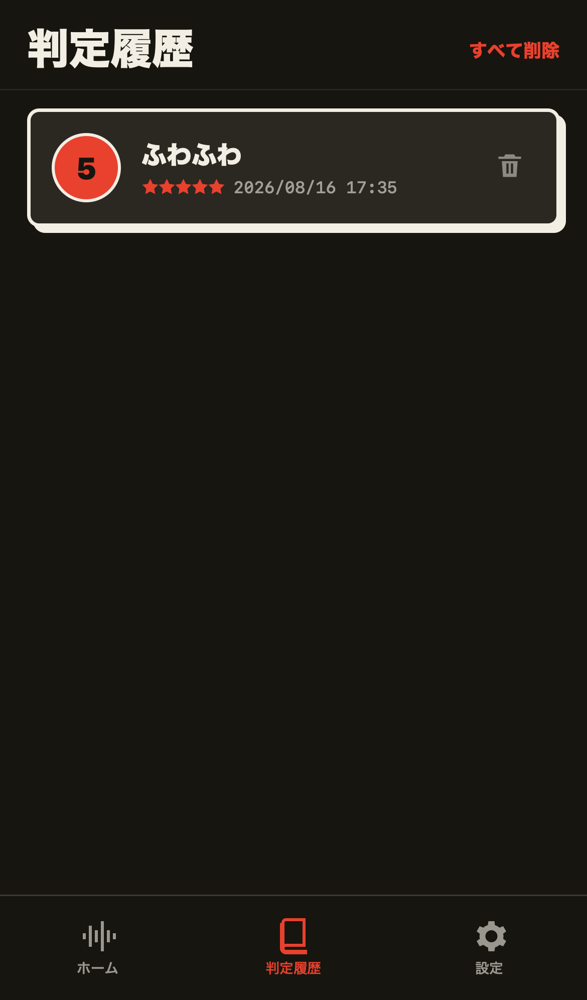 | 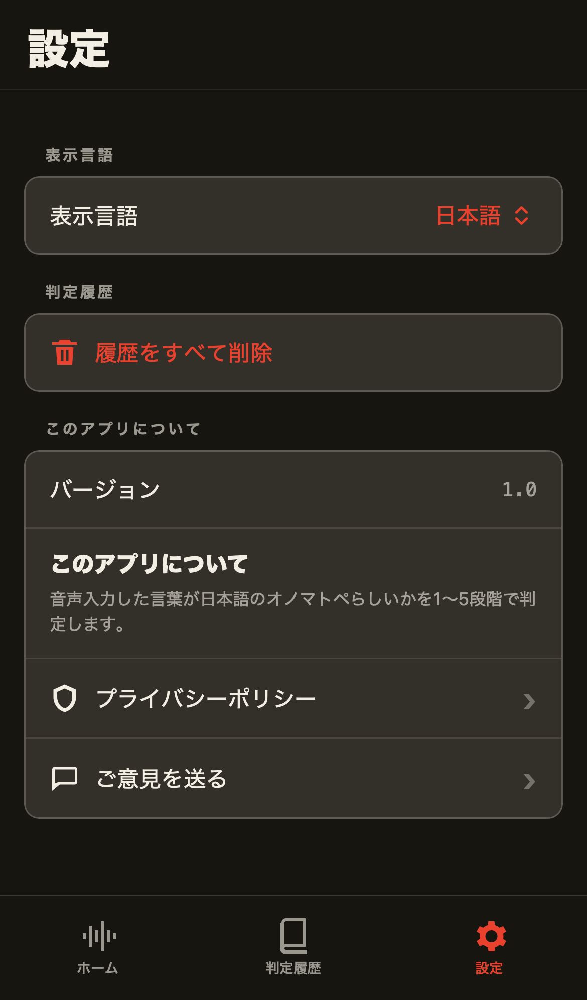 |
| 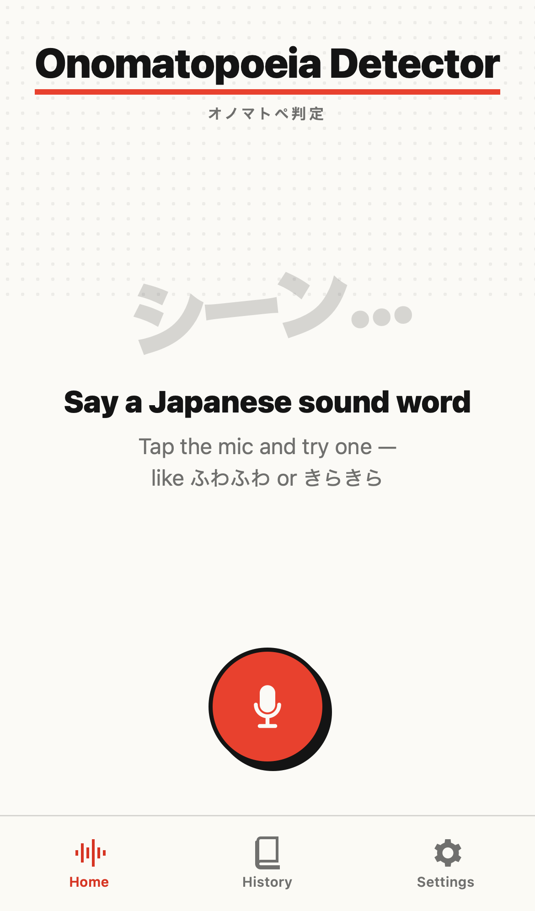 | 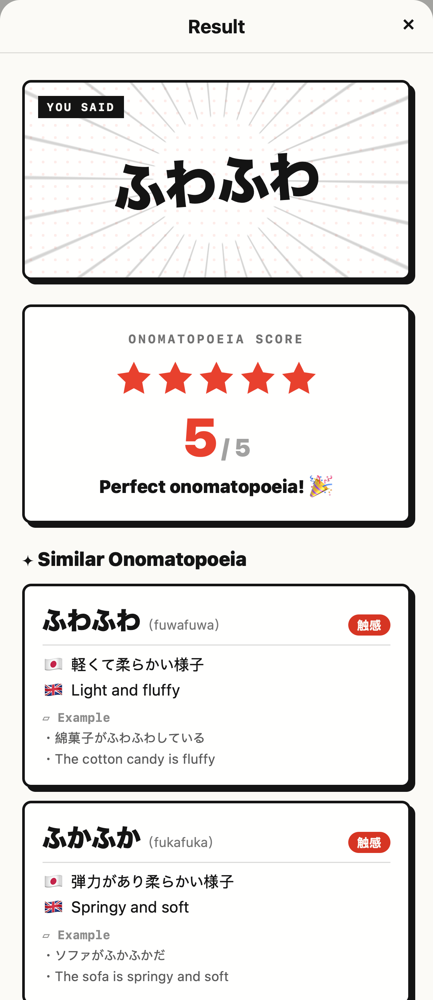 | 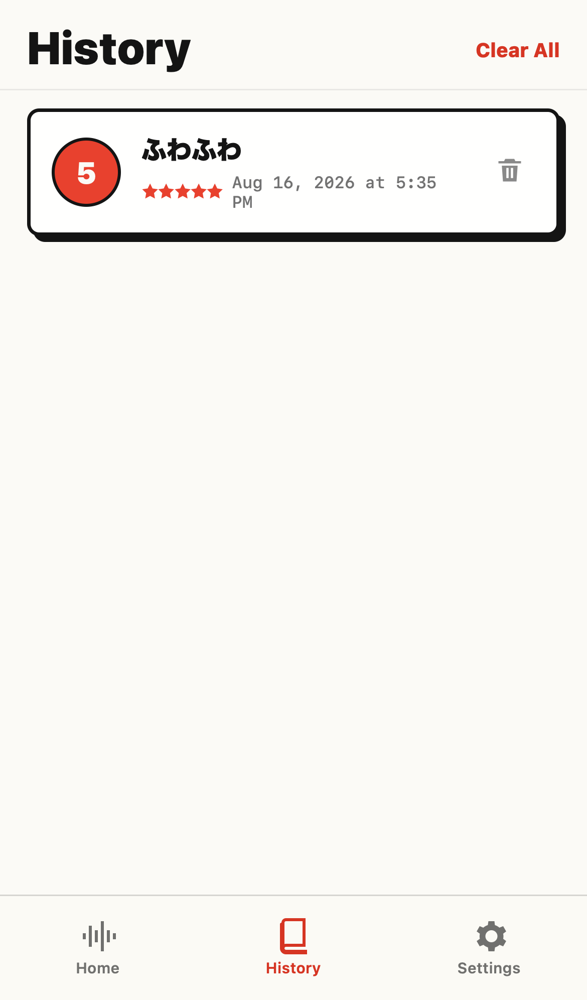 | 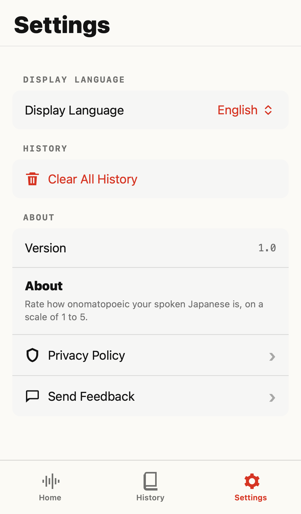 |
| 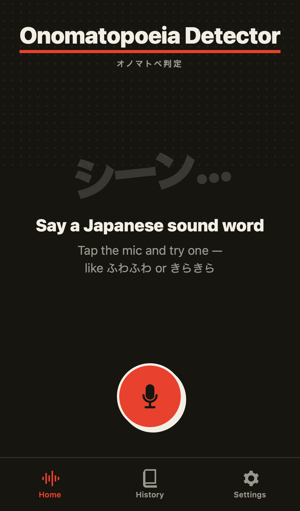 | 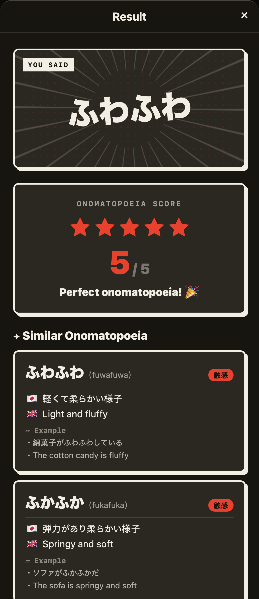 | 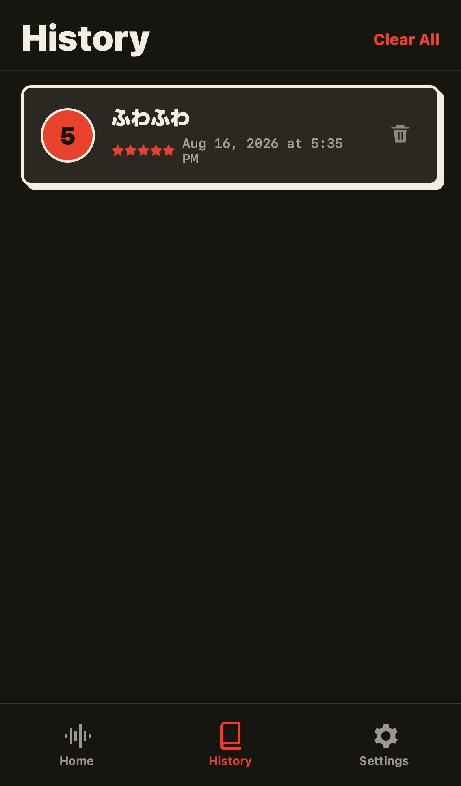 | 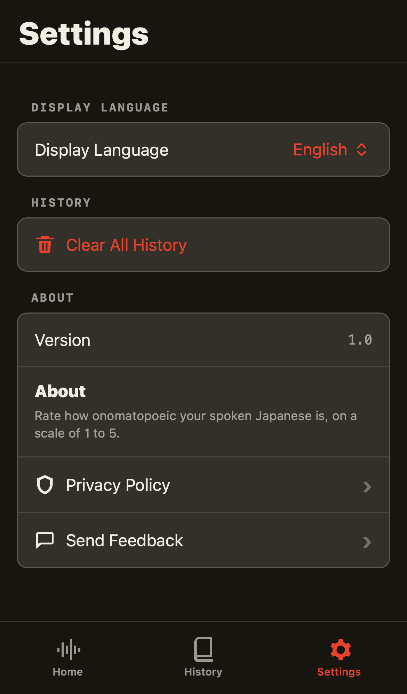 |

</details>

画面はPWA版のものです。iOS版・Android版も同じデザインです。撮り直すときは `cd web && npm run screenshots` を実行してください（音声認識は差し替えるため、実機もマイクも要りません）。

## Android版

Kotlin、Jetpack Composeで実装したAndroid版は `android/` にあります。iOS版と同じ3タブ、マンガの描き文字を基調としたデザイン、判定アルゴリズム、最大100件の端末内履歴、日本語・英語UIを備えています。判定辞書は3プラットフォームで共有している `shared/onomatopoeia_dict.json` をビルド時にassetsへ取り込みます。

### 必要環境

- JDK 17以上（Gradle Wrapperは8.9を使用）
- Android SDK 35 / Build-Tools 35.0.0
- Android 8.0（API 26）以上の端末（実機推奨 — エミュレータでは音声認識が制限されます）

`android/local.properties` にAndroid SDKの場所を書きます。

```
sdk.dir=/Users/<ユーザー名>/Library/Android/sdk
```

### ビルドと実行

```sh
cd android
./gradlew assembleDebug          # デバッグAPKを生成
./gradlew installDebug           # 接続中の端末へインストール
```

生成物は `android/app/build/outputs/apk/` に出力されます。

### 配布用のビルド

Google Playへ出す場合はApp Bundleを作ります。署名鍵はリポジトリに置かず、環境変数から渡します。

```sh
export ANDROID_KEYSTORE_PATH=/path/to/release.keystore
export ANDROID_KEYSTORE_PASSWORD=...
export ANDROID_KEY_ALIAS=...
export ANDROID_KEY_PASSWORD=...
./gradlew bundleRelease
```

環境変数を設定しない場合は署名なしで組み上がります（CIのビルド確認はこの経路です）。

表示言語はアプリ内で切り替えるため、`bundle` の言語分割は無効にしています。有効にすると端末の言語ぶんしか配信されず、切り替え先の文言が無くなります。

なお配信サイズは約19MBで、その大半をkuromojiの辞書が占めます。App Bundleの分割配信で減るのは画面密度やABIに依存する部分だけなので、**App Bundleにしてもサイズはほとんど変わりません**（bundletoolでの実測値: 分割後も19.3MB）。サイズを削るなら辞書そのものの見直しが必要です。

### Android版のテスト

```sh
cd android
./gradlew testDebugUnitTest
```

判定エンジンとひらがな変換について、iOS版・Web版と同じ期待値のテストを実行します。

### 構成

```
android/app/src/main/java/com/kensukeyoshida/onomatopoeiadetector/
├── MainActivity.kt                     # エントリーポイント
├── OnomatopoeiaApplication.kt          # 起動時の言語適用
├── ui/
│   ├── MainScaffold.kt                 # タブナビゲーション
│   ├── HomeScreen.kt                   # メイン画面（録音ボタン・波形）
│   ├── ResultScreen.kt                 # 評価結果＋類似オノマトペカード
│   ├── HistoryScreen.kt                # 判定履歴
│   ├── SettingsScreen.kt               # 設定・プライバシーポリシー
│   ├── Components.kt                   # マンガ調ボタンなどの共通部品
│   ├── AppViewModel.kt                 # 画面状態
│   └── theme/Theme.kt                  # 網点・集中線・コマ枠・書体
├── engine/OnoEngine.kt                 # 評価エンジン（辞書照合・音韻解析）
├── speech/SpeechManager.kt             # 音声認識
├── text/JapaneseAnalyzer.kt            # 読み推定・品詞判定（kuromoji）
├── data/                               # 辞書読み込み・Room・言語設定
└── model/Models.kt                     # データモデル
```

### iOS版との違い

同じデザイン・機能を目指していますが、プラットフォームの制約から次の点が異なります。判定結果そのものは3実装で一致し、同じ点数表のテストで担保しています。

| 項目 | Android版 | iOS版 |
|------|-----------|-------|
| 音声認識 | `SpeechRecognizer`。端末上のエンジンを優先し、日本語モデルが無い端末では端末の音声認識サービスへフォールバック | `SFSpeechRecognizer`（オンデバイス指定） |
| 読み推定・品詞判定 | kuromoji（IPADIC、Web版と同じ辞書） | NLTaggerの単語分割＋助詞・動詞の一覧照合。NLTaggerは日本語の品詞を返さないため |
| 表示言語の切替 | 即時反映 | 次回起動時に反映 |
| 書体 | M PLUS Rounded 1c を同梱（SIL Open Font License 1.1） | SF Rounded |

音声認識がオンデバイスに限られないため、プライバシーポリシーの記述もWeb版と同じ表現に合わせています。

## PWA（Web版）

React、TypeScript、Viteで実装したWeb版は `web/` にあります。既存iOS版と同じ3タブ、判定アルゴリズム、最大100件の端末内履歴、日本語・英語UIを備えています。

### 必要環境

- Node.js 22+
- npm 10+
- マイクを使う場合はHTTPSまたはlocalhost

### 開発とビルド

```sh
cd web
npm install
npm run dev
```

プロダクション用の静的ファイルは次のコマンドで `web/dist/` に生成されます。

```sh
npm run build
npm run preview
```

`dist/` を任意のHTTPS対応静的ホスティングへ配置できます。Web App ManifestとService Workerが含まれ、初回読み込み後は画面、辞書、判定、履歴をオフラインで利用できます。

### セキュリティヘッダー

ビルド成果物にはCloudflare PagesとNetlifyが認識する `dist/_headers` が含まれます。CSP、クリックジャッキング対策、MIMEスニッフィング対策、リファラー制限、HSTS、Permissions Policyを設定し、マイクは同一オリジンのPWAだけに許可しています。`npm run preview` でも同じヘッダーを返します。

ヘッダーの定義は `web/security-headers.ts` の1箇所にまとめ、`npm run preview` の応答と `dist/_headers` の両方をそこから生成します。両者が一致することはE2Eで検証しています。Service Workerは `Cache-Control: no-cache` を指定し、新しい版が滞留しないようにしています。

`_headers` に対応しないホスティングを利用する場合は、`web/security-headers.ts` の内容をそのサービスのレスポンスヘッダー設定へ移してください。HSTSを有効にするため、本番環境は必ずHTTPSで配信してください。

### Web版のテスト

```sh
npm test
npx playwright install chromium webkit  # 初回のみ
npm run test:e2e
```

### プライバシーポリシーの公開

ストアの審査や配布ページからは、アプリの外から読めるURLを求められます。`dist/privacy/` に単体で開けるページを出力しており、配信URLの `/privacy/`（言語で自動振り分け）、`/privacy/ja.html`、`/privacy/en.html` で読めます。

文言はアプリ内の表示と同じ翻訳から生成しているため、書き写しによるずれが起きません。生成は `npm install` と `npm run build` のたびに走ります。

### iPhoneへのインストール

1. Safariで配信URLを開く
2. 共有ボタンをタップする
3. 「ホーム画面に追加」を選ぶ

Web版は利用可能な場合にオンデバイス音声認識を優先します。利用できない場合はブラウザの音声認識サービスへフォールバックするため、その場合の音声認識にはネットワーク接続が必要です。履歴と表示言語はサーバーではなく、現在の端末・ブラウザ・サイト単位のIndexedDBとWeb Storageに保存され、別のユーザーや端末とは共有されません。

> [!IMPORTANT]
> WebKitの制約により、iPhoneでホーム画面に追加したPWAでは音声認識サービスを利用できない場合があります。その場合、アプリ内の「Safariで開く」から同じURLをSafariタブで開いて録音してください。また、iPhoneの「設定」でSiriと音声入力が有効になっている必要があります。リリース前には対象iOS実機のSafariタブとホーム画面版の両方で録音を確認してください。

## 必要環境

- Xcode 15.0+
- iOS 16.0+（実機推奨 — シミュレータではマイク・音声認識が制限されます）

## セットアップ

1. **プロジェクトを開く**
   ```
   open OnomatopoeiaDetector.xcodeproj
   ```

2. **Bundle Identifierを変更**（署名エラー回避）
   - Target → Signing & Capabilities
   - Bundle Identifier を `com.yourname.OnomatopoeiaDetector` に変更
   - Team を自分のApple IDに設定

3. **ビルド & 実行**
   - 実機を接続してRunボタン
   - 初回起動時にマイク・音声認識の許可を求めるダイアログが表示されます

## プロジェクト構成

判定辞書 `shared/onomatopoeia_dict.json`（51語、日英の意味付き）は3プラットフォームで共有します。iOS版はXcodeのリソースとして、PWA版はimportで、Android版はビルド時のコピーで取り込みます。

```
OnomatopoeiaDetector/
├── OnomatopoeiaDetectorApp.swift     # エントリーポイント
├── ContentView.swift                  # タブナビゲーション
├── Views/
│   ├── HomeView.swift                 # メイン画面（録音ボタン・波形）
│   ├── ResultView.swift               # 評価結果＋類似オノマトペカード
│   ├── HistoryView.swift              # 判定履歴
│   └── SettingsView.swift             # 設定（言語・履歴クリア）
├── ViewModels/
│   └── AppViewModel.swift             # MVVM ViewModel
├── Models/
│   ├── Models.swift                   # データモデル
│   ├── PersistenceController.swift    # Core Data管理
│   ├── HistoryEntity.swift            # NSManagedObject
│   └── OnomatopoeiaDetector.xcdatamodeld/
├── Engine/
│   ├── OnoEngine.swift                # 評価エンジン（辞書照合・音韻解析）
│   └── SpeechManager.swift            # AVFoundation + Speech Framework・音声認識結果のひらがな変換
├── Localizable/
│   ├── ja.lproj/Localizable.strings   # 日本語UI文字列
│   └── en.lproj/Localizable.strings   # 英語UI文字列
└── Info.plist                          # マイク・音声認識権限設定

OnomatopoeiaDetectorTests/
├── AppLanguageTests.swift
├── OnoEngineTests.swift
├── PersistenceControllerTests.swift
└── SpeechTextConverterTests.swift

```

## テスト

Xcodeでは共有scheme `OnomatopoeiaDetector` を選び、⌘UでUnit Testを実行します。

CLIでは利用可能なiOS Simulatorを指定して実行します。

```sh
xcodebuild test \
  -project OnomatopoeiaDetector.xcodeproj \
  -scheme OnomatopoeiaDetector \
  -destination 'platform=iOS Simulator,name=iPhone 16'
```

## 主な機能

| 機能 | 詳細 |
|------|------|
| 音声入力 | タップで録音開始、最大10秒、自動停止 |
| 音声認識 | SFSpeechRecognizer（日本語・オンデバイス） |
| ひらがな表示 | 音声認識結果をひらがな化し、`しいん` → `しーん` など一部のオノマトペ長音表記を補正 |
| 5段階評価 | 辞書完全一致は評価5。その他は辞書照合40%・音韻パターン30%・音象徴20%・形態素10% |
| 類似表示 | スコア3以上で類似オノマトペの日英意味・例文表示 |
| 履歴 | Core Dataで最大100件保存 |
| 多言語UI | 日本語・英語（システム言語自動追従） |

## 技術スタック

- SwiftUI + MVVM
- AVFoundation（録音）
- Speech Framework（日本語音声認識・オンデバイス）
- NaturalLanguage（形態素解析）
- Core Data（履歴永続化）
- Localizable.strings（日英対応）

## 評価アルゴリズム

入力は評価前にカタカナをひらがなへ正規化し、空白・記号を除去します。

1. 辞書完全一致: 51語の辞書の `word`（カタカナ見出しも正規化して比較）と一致した場合は評価5
2. 辞書照合スコア（40%）: 完全一致以外の部分一致度。2文字以上のときだけ照合します（`reading` はローマ字表記のため照合には使いません）
3. 音韻パターンスコア（30%）: ABAB反復・促音・長音・撥音などの検出
4. 音象徴スコア（20%）: 濁音率・半濁音・長音マーカーなどの割合
5. 形態素解析スコア（10%）: 助詞・動詞を含まない独立語らしさ。撥音止めのオノマトペを助詞込みの文と誤判定しないよう、単独の「ん」は助詞として数えません

類似オノマトペはLevenshtein距離 + 文字重複率で算出。

## 音声認識結果の表記

音声認識結果は、画面表示・評価・履歴保存に渡す前にひらがなへ変換します。

- `SFTranscription` の segment 候補にかな表記がある場合は、その候補を優先します
- 漢字だけが返った場合は tokenizer による読み推定にフォールバックします
- カタカナはひらがなへ変換します
- オノマトペとして明確な長音誤表記は補正します（例: `しいん` → `しーん`）

## 注意事項

以下はiOS版についての記述です。Android版とPWA版は端末上の認識を優先しつつ、利用できない場合は端末・ブラウザの音声認識サービスへフォールバックします。

- 音声認識はインターネット不要（オンデバイス処理）
- 音声データは端末内でのみ処理され、外部送信されません
- シミュレータでは音声入力機能が制限されるため、音声入力の確認は実機推奨です

## ご意見フォーム

設定画面の「ご意見を送る」は、`shared/feedback-form-url.txt` に書いたURLを開きます。**空のままなら3実装とも導線を出しません。**

```
https://docs.google.com/forms/d/e/xxxxxxxx/viewform
```

PWA版はビルド時に、iOS版とAndroid版もビルド時に読み込むため、変更後は再ビルドが必要です。

## 不具合の報告

送信先（Sentryのdsn）を渡したときだけ有効になります。渡さなければ初期化そのものを行わず、PWA版ではSDKのコードがバンドルから消え、CSPも自オリジンのみのままです。

```sh
# PWA
VITE_SENTRY_DSN=https://... npm run build

# Android
SENTRY_DSN=https://... ./gradlew assembleRelease

# iOS
xcodebuild -project OnomatopoeiaDetector.xcodeproj -scheme OnomatopoeiaDetector SENTRY_DSN=https://... build
```

送るのはエラーの内容と発生箇所、アプリのバージョン、OSとその版、端末の機種名だけです。音声・認識したことば・判定履歴は送りません。IPアドレスや利用者情報、画面の写し、操作の記録も採らない設定にしています。詳細はプライバシーポリシーに明記しています。

## サードパーティ

| 対象 | ライセンス | 利用箇所 |
|------|-----------|---------|
| kuromoji.js / kuromoji | Apache License 2.0 | 読み推定・品詞判定（PWA版・Android版） |
| mecab-ipadic-2.7.0-20070801 | NAIST（著作権表示と免責条項の再掲が必要） | kuromojiが使う形態素解析辞書 |
| M PLUS Rounded 1c | SIL Open Font License 1.1 | Android版の書体 |

告知文は次の場所にあり、いずれも配布物へ同梱されます。

- PWA版: `web/public/licenses/`（`npm install` のpostinstallで生成し、ビルド時に `dist/licenses/` へ出力）
- Android版: APK内の `META-INF/NOTICE.md` と `META-INF/LICENSE.md`。フォントは `android/licenses/OFL-MPLUSRounded1c.txt`
- iOS版は形態素解析にOS標準のNaturalLanguageを使うため、同梱している第三者ソフトウェアはありません

## CI

GitHub Actionsで3プラットフォームを検証します。判定辞書 `shared/onomatopoeia_dict.json` は3プラットフォームすべてが参照するため、辞書を変更した場合はすべてのワークフローが起動します。

| ワークフロー | 実行契機 | 内容 |
|-------------|---------|------|
| `web.yml` | push / PR（`web/**`、辞書） | ユニットテスト、ビルド、Playwright E2E |
| `android.yml` | push / PR（`android/**`、辞書） | ユニットテスト、lint、デバッグビルド |
| `ios.yml` | PR（iOS関連）と手動実行のみ | シミュレータでのユニットテスト |

`ios.yml` はmacOSランナーがLinuxの10倍の分数を消費するため、pushでは起動しません。
